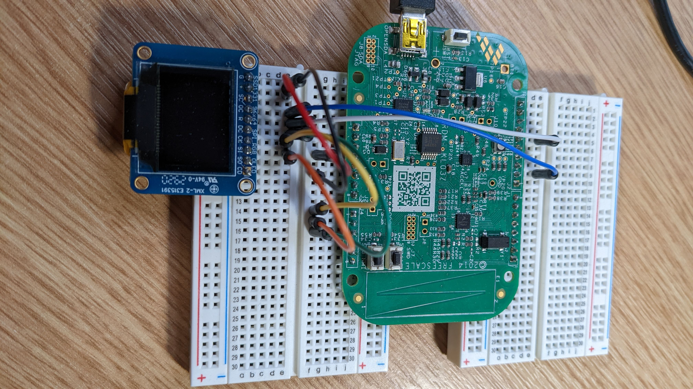
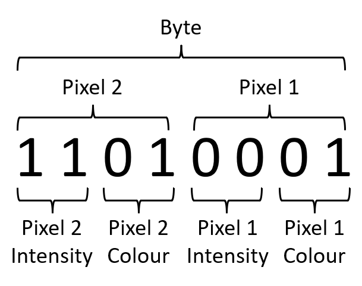
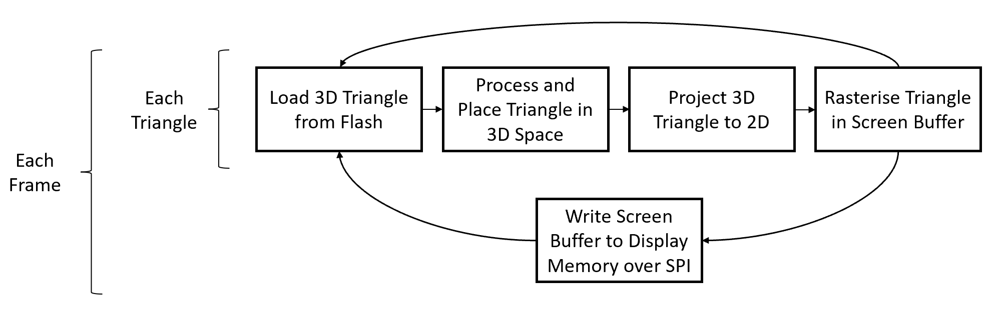

# EmbeddedGraphicsRender

## Introduction

This repository is a fork of the *Warp* firmware which can be found [here](https://github.com/physical-computation/Warp-firmware). This project is built upon the basis of the Warp firmware for a number of reasons:
- To borrow its compatibility with FRDM-KL03 development board.
- Its convenient and portable build process.
- Its KSDK integration.

Implemented is a framework to render simple 3D graphics on an OLED display. A microcontroller carries out the computations - hence memory considerations are paramount in the implementation.

## Repository Layout

Much of the repositary matches that of the original Warp firmware. Almost all of the changes implemented in this projection lie in the `src/boot/ksdk1.1.0/graphics`. The most central file to the implementation is `graphics.*` so it is advised to look there to begin to gain an intuition of the implementation.

## Demos

Included in the framework are two demos used to highlight various aspects of the functionality of the low-level graphics rendering framework.
- The first, which can be seen here: `demos/square.mp4`, is that of a square being rotated in 3D space around a central point which does *not* lie on its plane. This demo was used to demonstrate how the relative intensity of the square can be modulated with respect to the angle of the normal to the plane compared to the cameras viewing angle. As to be seen below, the implementation of the relative intensity calculations in an efficient manner is a large consideration of the program.
- The second, found in `demos/cube.mp4`, shows a 3D cube being rotated in 3D space around its 'centre of mass'. This demo highlights the ability of the of the framework to render triangles of various normal angle, shape, colour and size. Admittedly, there appear to be some minor perspective issues which I believe can be explained by a combination of the following. Firstly, the implementation may be marginally incorrect somewhere however the mathematics behind the program was checked and verified many times. In the interest of this project and its purpose, more effort was put into debugging the low-level program as opposed to graphics issues especially as the current result is still satisfactory. Secondly, as the OLED display is so small, the pixel pitch is not insignificant with respect to the screen size. Hence, different primary colour (RGB) triangles are very slightly translated horizontally on the screen due to the fact that, of course, each pixel is made of three sub-pixels (RGB).

## Hardware

- FRDM-KL03 development board, available [here](https://www.mouser.co.uk/ProductDetail/NXP-Semiconductors/FRDM-KL03Z?qs=y0HsvvugQ45hZ%2FWfA4he7w%3D%3D) and elsewhere.
- Adafruit mini OLED display, available [here](https://www.adafruit.com/product/684) and elsewhere.
- Basic breadboarding equipment including wires.
- Mini USB to Mini USB cable.
  
## Software Dependencies

- KSDK1.1 (Included with Warp firmware)
- ARM GNU toolchain, available [here](https://developer.arm.com/tools-and-software/open-source-software/developer-tools/gnu-toolchain/gnu-rm).
- SEGGER JLINK tools, available [here](https://www.segger.com/downloads/jlink/?).
- (More information regarding these are given in the Warp firmware repository).

## Getting Started

### Wiring the Hardware

- *GND*: KL03 GND to OLED #1 (Black)
- *VCC*: KL03 3.3V to OLED #2 (Red)
- *MOSI*: KL03 PTA8 to OLED #8 (Orange)
- *SCK*: KL03 PTA9 to OLED #7 (Yellow)
- *CS*: KL03 PTB11 to OLED #4 (Blue)
- *DC*: KL03 PTA12 to OLED #6 (Green)
- *RST*: KL03 PTB0 to OLED #5 (White)

An image of the wiring following the example colours given above is given below



### Building the Firmware

The build process of this program is exactly that of the Warp firmware. In order to build a particular demo, edit the preprocessor definitions in `graphics.h`. Comments in the file indicate what should be edited and where.

To load the firmware onto the KL03 on the development board, the following commands should be executed in the SEGGER JLINK software:
```
unlock kinetis
loadfile <full-path-to-this-repository>/build/ksdk1.1/work/demos/Warp/armgcc/Warp/release/Warp.srec
r
go
```

## Implementation Notes

The KL03 only has 2KB of SRAM available to it. Hence, clearly, the limiting resource is memory as opposed to compute power. To illustrate this, consider that the screen has $96 \times 64$ pixels. Consider allocating one byte per colour in RGB to the pixel such that each pixel has three bytes. Storing a screen buffer would use $96 \times 64 \times 3 \approx 18kB$, 9 times the total memory available! Therefore, certain aspects of the program had to carefully considered as to most efficiently use this resource.

Firstly, most obviously, only a square sub section of the screen was in use at any given time - there is simply no way to use the entire screen. Secondly, half a byte was allocated to each pixel instead of three bytes or even one byte. Therefore, in processing the graphics, MANY bitshifting and bitwise operations were employed (as can be seen in `graphics.h` and `devSSD1331.c`.) The breakdown of a byte is given as follows:



Clearly, this means that opnly four colours can be used in a byte (red, green, blue, black) only with three different relative intensities (1, 0.66, 0.33, 0). Nonetheless, this complicated yet somewhat novel approach was able to produce reasonable results in the very limited memory space.

Finally, the structure to rendered was not stored in the limited SRAM but in the flash memory which, with 32kB of storage, is essentially almost endless with respect to the size of the 2kB of SRAM available. Therefore, for each frame rendered, only one triangle within that frame was rendered at a time such that only one needed to be stored at a given time. This is better illustrated by the diagram below.



Other memory-intensive quantities such as a 8-bit sine lookup table were also stored in flash. 

Some further notes on implementation include that the triangles were rasterised using an adapted version of Bresenham's line rasterisation algorithm. While much of the implementation of the triangle rasterisation with informed by Michael Abrash's *Graphics Programming Black Book*, all code written is my own. See the code itself for more information. 

As a further additional note, almost all code written is my own aside from that pre-existing within the Warp firmware. Therefore, this project was an incredibly large undertaking but was incredibly informative - I learnt a lot about both graphics rendering a memory-contrained bare metal programming!

## Limitations / Suggestions for Future Work

- While 4 bits are currently allocated per pixel, a relatively easy extra option to add would be to allow only 2 bits per pixel. This would entail slightly adapting the 4 pixel bit shifting routines. Of course, this would no longer allow for any relative intensities to be used, only red, green, blue and black = off. This would of course allow for a larger screen size to be used at the cost of 'lighting effects'.
- As mentioned in the *demos* section, there appear to be some perspective issues with the cube demo. This could be blamed on pixel pitch, an inaccuracy in the implementation or both. Only so much time could be allocated to this project so the time was largely allocated to low-level programming issues. This should be an achievable fix for those versed in computer graphics and perspective projection.
- Currently the program can only render convex shapes (such as a cube) effectively. To allow for the correct ordering of triangles, the *painters* algorithm could be implemented. That is, the triangles to be rendered are sorted in terms of their z-components and rendered accordingly such that certain spaces are not inncorrectly overwritten. Of course, in the programs current state, the triangles are stored in immutable flash memory. Therefore, future implementation could consider sorting an array of pointers to these triangles on each frame. Bubble sort could be an attractive means of sorting due to its effectiveness in the case that the array is *nearly* sorted - effort used on the previous frame would not be wasted! The implementation of this algorithm was not carried out due to time constraints but it is certainly the natural next step for the framework.
